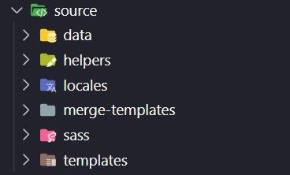
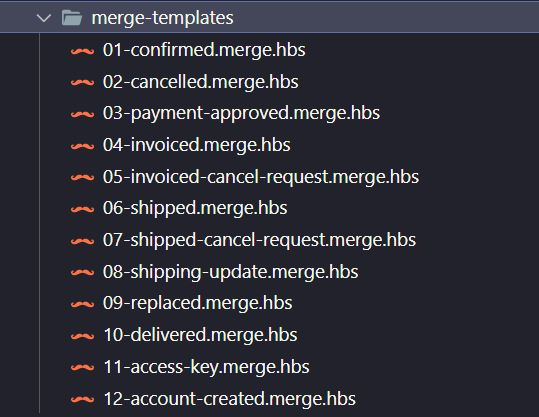
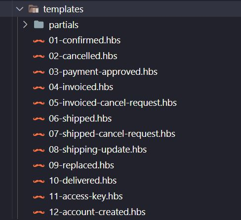

<h1 align="center">
    VTEX Multi Language E-mails
</h1>

## :rocket: Overview

VTEX Emails is an email framework for developing transactional email templates for VTEX E-commerces.

This is a improved version of [VTEX Emails](https://github.com/vtex/vtex-emails) which we can use to make multi languages e-mails.

## :open_file_folder: Folders and Structure

  | Folder | Description |
  |--|--|
  |`public`	| compiled files used to preview with localhost:8000 |
  |`dist`  |compiled files - copy and paste inside message center template  |
  |`source` |working folder  |

### Source folder

  

  | Source folder| Description |
  |--|--|
  |`data`  |  JSON files containing Orders data|
  | `helpers` | VTEX's Helpers functions |
  | `locales` |i18n files  |
  | `merge-templates` |Builder used to combine multiple languages ​​into a single file  |
  | `sass` |styles folder  |
  | `templates` |e-mails templates  |


### Sass folder

> Inside Sass folder you can see a `custom.scss` file which is used to put custom styles of templates

### :pushpin: Merge Templates

One of master pieces of this automation are the merge templates.

Each template have your merge-template file.

Example:
> **Template**: 01-confirmed.hbs <br>
> **Merge Template**: 01-confirmed.**merge**.hbs

>**Tip**: All of merge templates have a **merge** before the extension file.

You will see something like this:

  

```handlebars
<!DOCTYPE html PUBLIC "-//W3C//DTD XHTML 1.0 Transitional //EN"  "http://www.w3.org/TR/xhtml1/DTD/xhtml1-transitional.dtd">

<html  xmlns="http://www.w3.org/1999/xhtml" xmlns:o="urn:schemas-microsoft-com:office:office" xmlns:v="urn:schemas-microsoft-com:vml">

	<!-- partial:../source/templates/partials/main/_html-head.hbs -->
	<!-- partial -->

	<body>
		{{#compare  orders.0.clientPreferencesData.locale  '=='  'pt-BR'  }}
			<!-- partial:pt-BR/01-confirmed.hbs -->
			<!-- partial -->
		 {{else}}
			<!-- partial:en-US/01-confirmed.hbs -->
			<!-- partial -->
		{{/compare}}
	</body>
</html>
```
### Templates

 

  | Templates folder| Description |
  |--|--|
  |`partials`  |  E-mails parts|
  | `partials > main` | E-mails header and footer content|


### You must NOT add, change or modify:

- `helpers` you can use only Handlebars and VTEX's Helpers

## :computer: How To Start

### Installation

1.  Download or clone this repo
2.  Install npm dependencies: run `npm install` or `yarn install`

### Developing Mode

0.  Requires node `8.x`
1.  Run `npm run gulp dev` or `yarn gulp dev`
2.  Go to [http://localhost:8000/](http://localhost:8000/)
3.  Choose `finals` folder and open the template that you want to preview

### Generating an exportable VTEX template

1.  Run `npm run gulp dist` or `yarn gulp dist`
2.  Go to `dist` folder
3.  Go to `finals` folder
4.  Copy the template content and paste it in VTEX Message Center

### Generating a light preview version for testing

1.  Run `npm run gulp preview` or  `yarn gulp preview`
2.  Go to `public` folder, copy the template content and test it using services like MailChimp


### All ready, now app is running.

---

Improved with 💗 by [Patryck Gratão]('https://www.linkedin.com/in/ppgratao/')